<!--
  @yeegz · Yousof Selim — GitHub profile README
  Every visual is a hand-built, self-contained SVG (fonts embedded as data-URIs,
  halftone drawn as sampled vector dots, motion via SMIL). No third-party badge
  or stats services. Edit the .svg files in /assets; regenerate with build.py.
-->

  

  <a href="https://yeegz.github.io">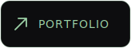</a>&nbsp;&nbsp;
  <a href="https://linkedin.com/in/ysf-slm">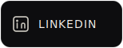</a>&nbsp;&nbsp;
  <a href="mailto:yousofselim2@gmail.com">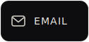</a>&nbsp;&nbsp;
  <a href="https://yeegz.github.io/Yousof-Selim-Resume.pdf">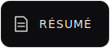</a>

&nbsp;

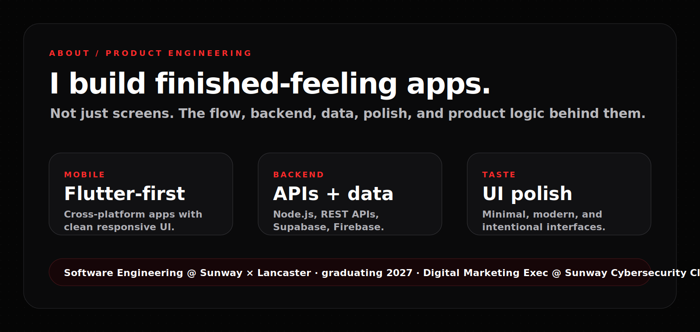


&nbsp;

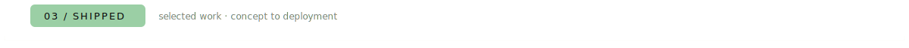

<a href="https://github.com/yeegz/Bupples-showcase"></a>

<a href="https://photoshoot-yeegz.web.app">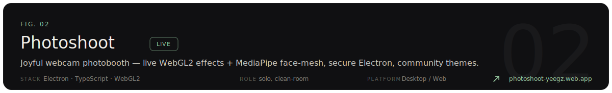</a>

<a href="https://yeegz.github.io">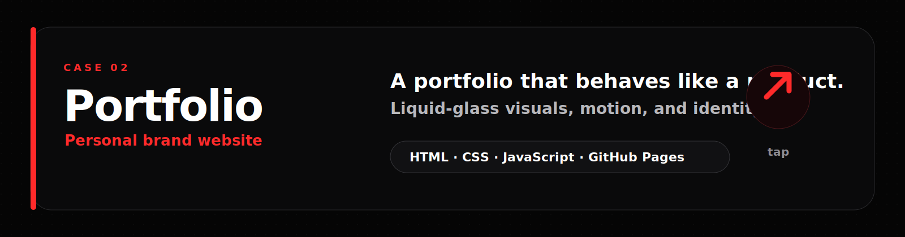</a>

<a href="https://yeegz.github.io"></a>

<a href="https://github.com/yeegz/To-Do-List-Board">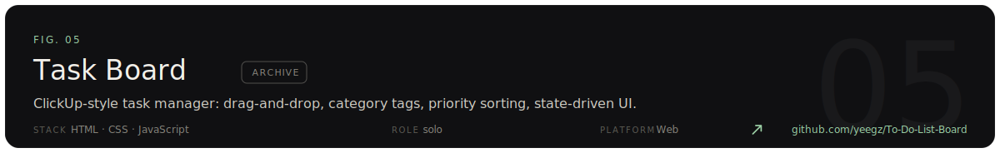</a>

<a href="https://yeegz.itch.io/fallenasteri">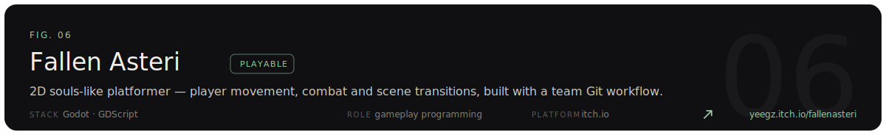</a>

&nbsp;


&nbsp;

<a href="mailto:yousofselim2@gmail.com">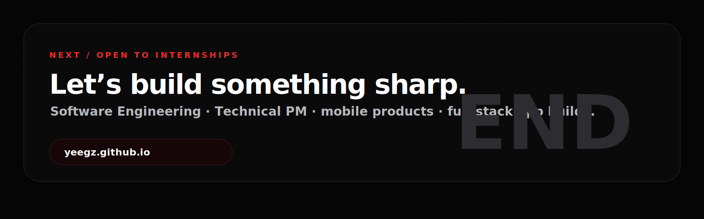</a>
