<!--
  Yousof Selim · @yeegz
  Redline profile README.
  Upload README.md and the /assets folder to the root of yeegz/yeegz.
-->

  

  
  &nbsp;
  
  &nbsp;
  

 

## about/

 

## shipped/

 

## proof/

  
  

 

  

