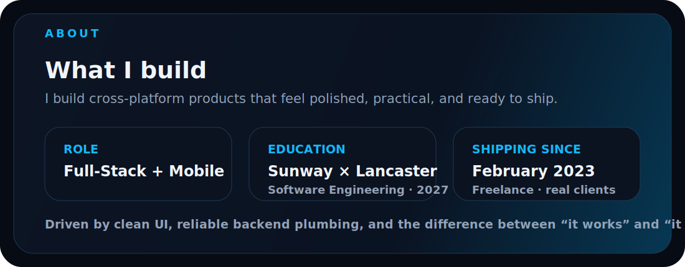
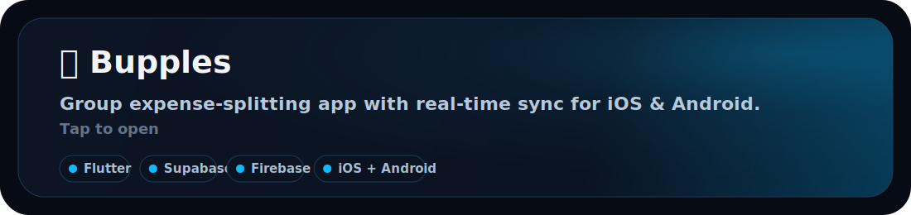
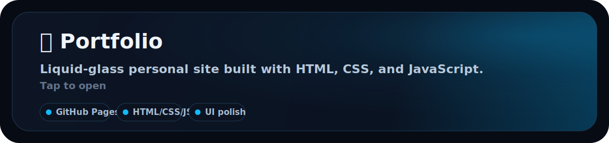
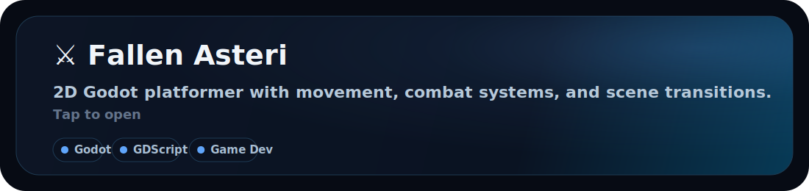
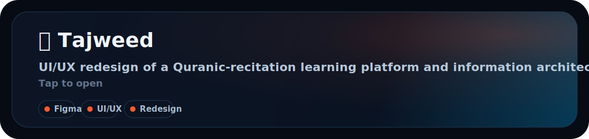

<!-- ════════════════════════════════════════════════════════════
     Yousof Selim · @yeegz — liquid-glass profile
     Put every SVG file in this ZIP at the ROOT of the yeegz/yeegz repo.
     ════════════════════════════════════════════════════════════ -->

  
  &nbsp;
  
  &nbsp;
  

### about/

### shipped/

real products — tap any card

 
 

### analytics/

  
  

  

  

  <picture>
    <source media="(prefers-color-scheme: dark)" srcset="https://raw.githubusercontent.com/yeegz/yeegz/output/github-snake-dark.svg" />
    <source media="(prefers-color-scheme: light)" srcset="https://raw.githubusercontent.com/yeegz/yeegz/output/github-snake.svg" />
    
  </picture>

