<picture>
  <source media="(max-width: 600px) and (prefers-color-scheme: dark)" srcset="assets/profile-dark-mobile.svg">
  <source media="(max-width: 600px) and (prefers-color-scheme: light)" srcset="assets/profile-light-mobile.svg">
  <source media="(prefers-color-scheme: dark)" srcset="assets/profile-dark.svg">
  <source media="(prefers-color-scheme: light)" srcset="assets/profile-light.svg">
  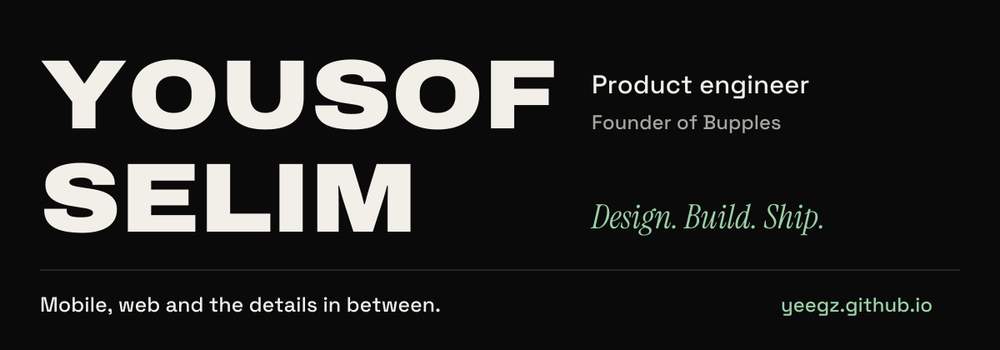
</picture>

  <a href="https://yousofselim.com">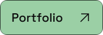</a>&nbsp;
  &nbsp;
  &nbsp;
  <a href="https://yousofselim.com/Yousof-Selim-Resume.pdf">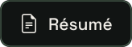</a>

👋 **I’m Yousof.** I design and build mobile and web products, from the first user flow through the backend, testing and release.

📱 Founder and sole developer of **[Bupples](https://yousofselim.com/work/bupples/)**, live on iOS and Android.

🎓 BSc (Hons) Software Engineering at **BSc (Hons) Software Engineering at Sunway University, in partnership with Lancaster University** · graduating **August 2027**.

🤝 **Open to selected freelance projects** and a **software engineering internship, January–April 2027**.

<picture>
  <source media="(max-width: 600px)" srcset="assets/profile-practice-mobile.svg">
  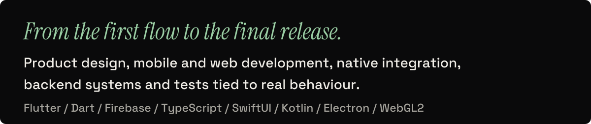
</picture>

### Selected work

<picture>
  <source media="(max-width: 600px)" srcset="assets/selected-bupples-mobile.svg">
  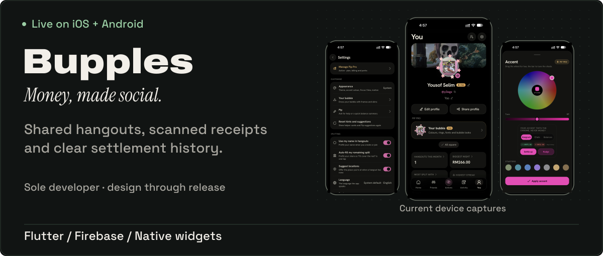
</picture>

Sole developer, from product design and the ledger to native widgets and store releases.

  <a href="https://apps.apple.com/my/app/bupples/id6777620291">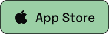</a>
  <a href="https://play.google.com/store/apps/details?id=com.bupples.bupples">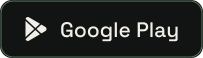</a>
  
  
  <a href="https://github.com/yeegz/Bupples-showcase">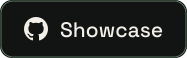</a>

 

<picture>
  <source media="(max-width: 600px)" srcset="assets/selected-adelante-mobile.svg">
  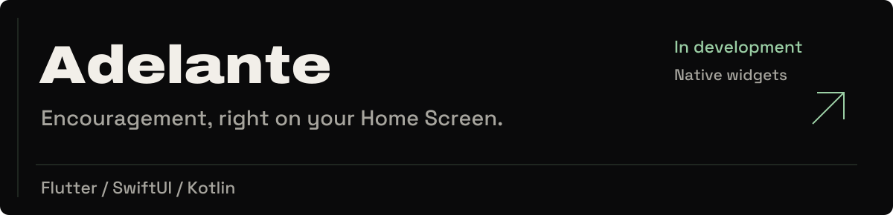
</picture>

A Flutter app with native SwiftUI/WidgetKit and Kotlin integration. Currently in development.

  
  
  

 

<picture>
  <source media="(max-width: 600px)" srcset="assets/selected-photoshoot-mobile.svg">
  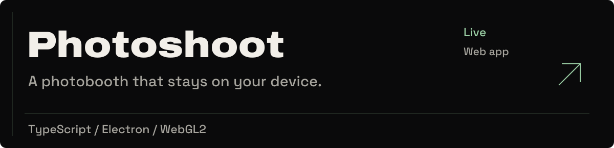
</picture>

Photos, strips and video with on-device effects. Live web app; Electron desktop source is available.

  <a href="https://photoshoot-yeegz.web.app/app/">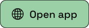</a>
  
  <a href="https://github.com/yeegz/photoshoot">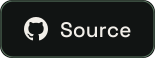</a>

 

<picture>
  <source media="(max-width: 600px)" srcset="assets/selected-wayclub-mobile.svg">
  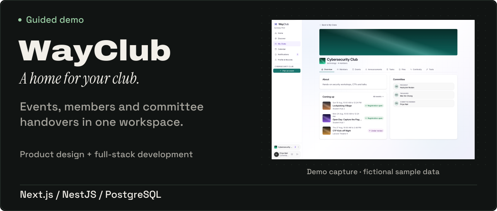
</picture>

Events, members and committee handovers. The guided interface demo uses fictional sample data.

  <a href="https://wayclub-live-demo.web.app/home?tour=1">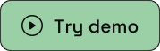</a>
  

 

<picture>
  <source media="(max-width: 600px)" srcset="assets/selected-codeatlas-mobile.svg">
  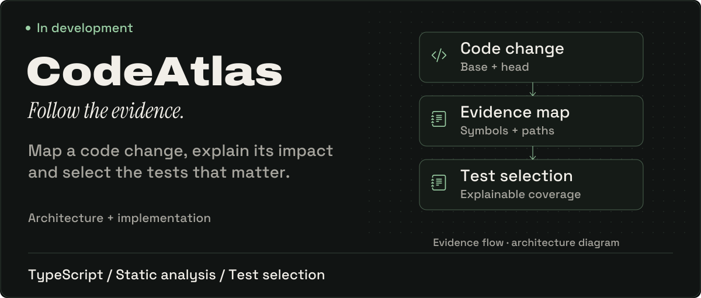
</picture>

TypeScript and JavaScript change analysis with inspectable evidence. Active development; see the implementation status.

  <a href="https://github.com/yeegz/CodeAtlas#current-implementation-status">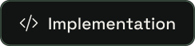</a>
  

 

<picture>
  <source media="(max-width: 600px)" srcset="assets/selected-asteri-mobile.svg">
  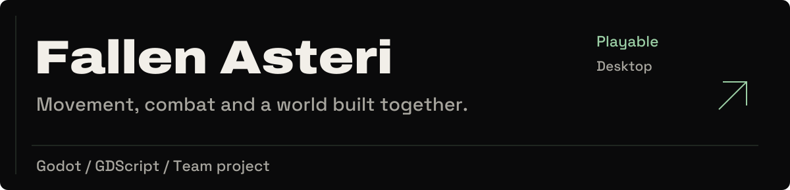
</picture>

My contribution: movement, combat, scene transitions and repository structure.

  <a href="https://yeegz.itch.io/fallenasteri">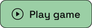</a>
  

 

Project details, source and release status

| Project | Current status | Engineering |
| :--- | :--- | :--- |
| Bupples | Live on iOS and Android | [Showcase](https://github.com/yeegz/Bupples-showcase) · [Case study](https://yousofselim.com/work/bupples/) |
| Photoshoot | Live web app; Electron source available | [Source](https://github.com/yeegz/photoshoot) · [Case study](https://yousofselim.com/work/photoshoot/) |
| WayClub | Guided interface demo with fictional data | [Showcase](https://github.com/yeegz/WayClub-showcase) |
| CodeAtlas | Active development | [Source and implementation status](https://github.com/yeegz/CodeAtlas) |
| Adelante | In development | [Showcase](https://github.com/yeegz/adelante-showcase) · [Case study](https://yousofselim.com/work/adelante/) |
| Fallen Asteri | Playable team project | [Source](https://github.com/yeegz/Fallen-Asteri) |

Bupples, Adelante and WayClub have public showcases; their application source is private. The portfolio case studies document my contribution, current screenshots and dated verification.

<picture>
  <source media="(max-width: 600px)" srcset="assets/profile-contact-mobile.svg">
  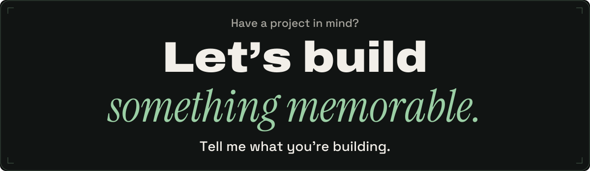
</picture>

  
  
  

Selected work updated September 2026. [About this profile’s artwork](tools/README.md).
