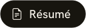
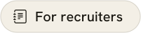
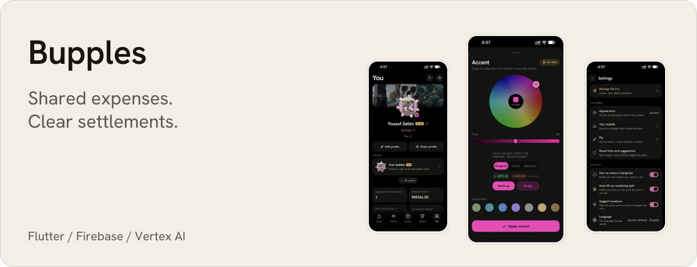
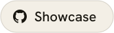
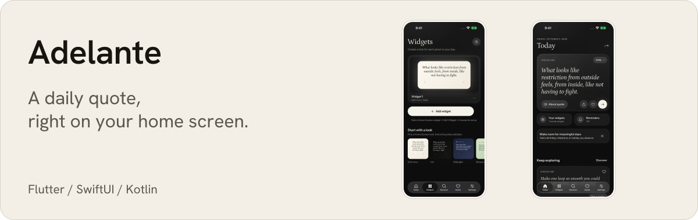
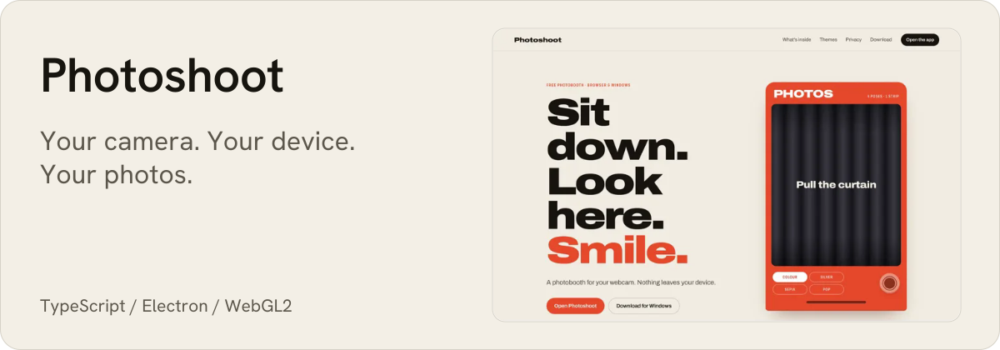
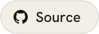
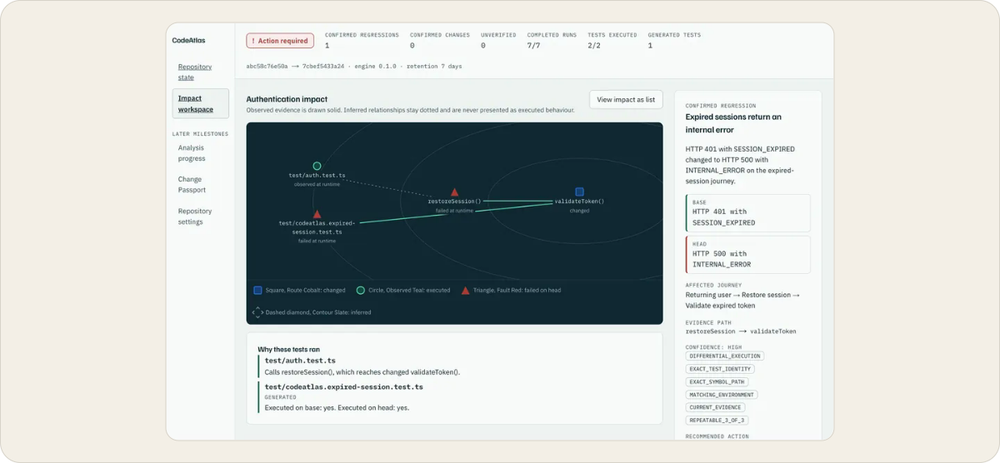
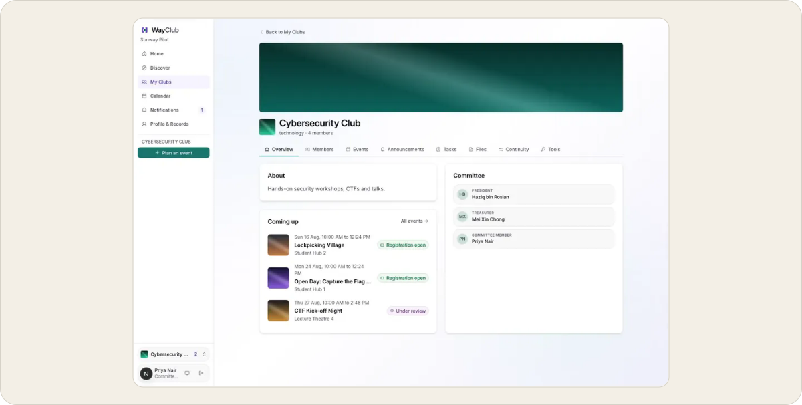

<picture>
  <source media="(max-width: 600px) and (prefers-color-scheme: dark)" srcset="assets/profile-dark-mobile.svg">
  <source media="(max-width: 600px) and (prefers-color-scheme: light)" srcset="assets/profile-light-mobile.svg">
  <source media="(prefers-color-scheme: dark)" srcset="assets/profile-dark.svg">
  
</picture>

<a href="https://yousofselim.com/Yousof-Selim-Resume.pdf"><picture><source media="(prefers-color-scheme: dark)" srcset="assets/link-resume-dark.svg"></picture></a>
<a href="https://yousofselim.com/"><picture><source media="(prefers-color-scheme: dark)" srcset="assets/link-portfolio-dark.svg"></picture></a>
<a href="https://yousofselim.com/simple/"><picture><source media="(prefers-color-scheme: dark)" srcset="assets/link-recruiters-dark.svg"></picture></a>

I build mobile and full-stack products, from the first user flow through the backend, testing and release. Founder and sole developer of **Bupples**.

**Available for a full-time internship, 25 January to 23 April 2027.** Based in Subang Jaya, Malaysia; open to remote or on-site roles.

## Selected work

<a href="https://yousofselim.com/work/bupples/" aria-label="Read the bupples case study">
<picture>
  <source media="(max-width: 600px) and (prefers-color-scheme: dark)" srcset="assets/selected-bupples-dark-mobile.svg">
  <source media="(max-width: 600px) and (prefers-color-scheme: light)" srcset="assets/selected-bupples-light-mobile.svg">
  <source media="(prefers-color-scheme: dark)" srcset="assets/selected-bupples-dark.svg">
  
</picture>
</a>

**Live on iOS and Android.** I designed and built the app, its multi-currency ledger, native integrations and store releases.

<a href="https://apps.apple.com/my/app/bupples/id6777620291"><picture><source media="(prefers-color-scheme: dark)" srcset="assets/link-app-store-dark.svg"></picture></a>
<a href="https://play.google.com/store/apps/details?id=com.bupples.bupples"><picture><source media="(prefers-color-scheme: dark)" srcset="assets/link-google-play-dark.svg"></picture></a>
<a href="https://yousofselim.com/work/bupples/"><picture><source media="(prefers-color-scheme: dark)" srcset="assets/link-case-study-dark.svg"></picture></a>
<a href="https://github.com/yeegz/Bupples-showcase"><picture><source media="(prefers-color-scheme: dark)" srcset="assets/link-showcase-dark.svg"></picture></a>

<a href="https://yousofselim.com/work/adelante/" aria-label="Read the adelante case study">
<picture>
  <source media="(max-width: 600px) and (prefers-color-scheme: dark)" srcset="assets/selected-adelante-dark-mobile.svg">
  <source media="(max-width: 600px) and (prefers-color-scheme: light)" srcset="assets/selected-adelante-light-mobile.svg">
  <source media="(prefers-color-scheme: dark)" srcset="assets/selected-adelante-dark.svg">
  
</picture>
</a>

**Live on the App Store.** A Flutter app with native widgets and offline content, built to keep working when the app stays closed.

<a href="https://apps.apple.com/us/app/adelante-daily-quotes/id6816598027"><picture><source media="(prefers-color-scheme: dark)" srcset="assets/link-app-store-dark.svg"></picture></a>
<a href="https://yousofselim.com/work/adelante/"><picture><source media="(prefers-color-scheme: dark)" srcset="assets/link-case-study-dark.svg"></picture></a>
<a href="https://github.com/yeegz/adelante-showcase"><picture><source media="(prefers-color-scheme: dark)" srcset="assets/link-showcase-dark.svg"></picture></a>

<a href="https://yousofselim.com/work/photoshoot/" aria-label="Read the photoshoot case study">
<picture>
  <source media="(max-width: 600px) and (prefers-color-scheme: dark)" srcset="assets/selected-photoshoot-dark-mobile.svg">
  <source media="(max-width: 600px) and (prefers-color-scheme: light)" srcset="assets/selected-photoshoot-light-mobile.svg">
  <source media="(prefers-color-scheme: dark)" srcset="assets/selected-photoshoot-dark.svg">
  
</picture>
</a>

**Live web app; Windows 1.0.1 released.** A photobooth with 17 real-time effects. No camera frame leaves the device.

<a href="https://photoshoot-yeegz.web.app/app/"><picture><source media="(prefers-color-scheme: dark)" srcset="assets/link-open-app-dark.svg"></picture></a>
<a href="https://github.com/yeegz/photoshoot/releases/tag/v1.0.1"><picture><source media="(prefers-color-scheme: dark)" srcset="assets/link-download-dark.svg"></picture></a>
<a href="https://yousofselim.com/work/photoshoot/"><picture><source media="(prefers-color-scheme: dark)" srcset="assets/link-case-study-dark.svg"></picture></a>
<a href="https://github.com/yeegz/photoshoot"><picture><source media="(prefers-color-scheme: dark)" srcset="assets/link-source-dark.svg"></picture></a>

<b>Under the hood</b> — engineering notes and more projects

### Bupples: a payment that disappeared

A simplified settlement plan can ask A to pay C even when the original debts were A → B → C. Reducing only a direct A → C debt found nothing. I changed the settlement path to reduce the original debt edges while preserving everyone’s net balance. Money stays in integer minor units throughout.

[Read the ledger decision and its trade-offs](https://yousofselim.com/work/bupples/#challenges)

### Adelante: widgets that agree without talking

Flutter, WidgetKit and Android RemoteViews run in separate processes. They use the same time-based rotation rule so widgets can advance offline without waiting for the app to open. iOS also receives a precomputed timeline within WidgetKit’s refresh budget.

[Read the native-widget architecture](https://yousofselim.com/work/adelante/#architecture)

### CodeAtlas: from a changed function to a reproduced regression

Maps a code change to the tests that reach it, runs both revisions and signs the evidence. The supported authentication fixture reproduces an expired-session response changing from HTTP 401 to HTTP 500.

<picture>
  <source media="(max-width: 600px) and (prefers-color-scheme: dark)" srcset="assets/selected-codeatlas-dark-mobile.svg">
  <source media="(max-width: 600px) and (prefers-color-scheme: light)" srcset="assets/selected-codeatlas-light-mobile.svg">
  <source media="(prefers-color-scheme: dark)" srcset="assets/selected-codeatlas-dark.svg">
  
</picture>

**Local CLI and evidence workspace**, built with TypeScript, Node.js and Vitest. Inferred relationships and observed behavior are shown separately, with a replay command for the supported fixture.

[Case study](https://yousofselim.com/work/codeatlas/) · [Implementation status](https://github.com/yeegz/CodeAtlas#current-implementation-status) · [Source](https://github.com/yeegz/CodeAtlas)

### WayClub: shared infrastructure, separate club data

A workspace for student clubs to plan events, approve proposals and manage registrations. I built the Next.js web app, NestJS API and PostgreSQL schema, with transaction-scoped tenant context and database-enforced access policies.

<picture>
  <source media="(max-width: 600px) and (prefers-color-scheme: dark)" srcset="assets/selected-wayclub-dark-mobile.svg">
  <source media="(max-width: 600px) and (prefers-color-scheme: light)" srcset="assets/selected-wayclub-light-mobile.svg">
  <source media="(prefers-color-scheme: dark)" srcset="assets/selected-wayclub-dark.svg">
  
</picture>

**Guided interface demo with fictional sample data.** The case study explains the isolation constraints and the trade-off of failing closed.

[Case study](https://yousofselim.com/work/wayclub/) · [Try the demo](https://wayclub-live-demo.web.app/home?tour=1) · [Showcase](https://github.com/yeegz/WayClub-showcase)

Bupples, Adelante and WayClub have public showcases; their application source is private.

**Tools I build with:** Flutter, Dart, SwiftUI, Kotlin, TypeScript, React, Next.js, NestJS, PostgreSQL and Firebase. Testing and delivery with Vitest, Playwright and GitHub Actions.

Take a detour

My portfolio has [a working terminal](https://yousofselim.com/terminal/). Start with `help` and see where it takes you.

Or play **[Fallen Asteri](https://yeegz.itch.io/fallenasteri)**, a Godot platformer built by three developers. I set up the repository workflow and worked on levels, animation, the HUD and combat tuning. [Source](https://github.com/yeegz/Fallen-Asteri).

## Let’s build something useful

Hiring an intern for January 2027? I’d like to hear what your team is building.

<a href="mailto:yousofselim2@gmail.com?subject=Software%20Engineering%20internship%2C%20January%202027"><picture><source media="(prefers-color-scheme: dark)" srcset="assets/link-email-dark.svg"></picture></a>
<a href="https://www.linkedin.com/in/ysf-slm/"><picture><source media="(prefers-color-scheme: dark)" srcset="assets/link-linkedin-dark.svg"></picture></a>

Sunway University / Lancaster University · Graduating August 2027. Compulsory university internship; placement requirements to be confirmed with Sunway.

Updated October 2026. [About the artwork](tools/README.md).
